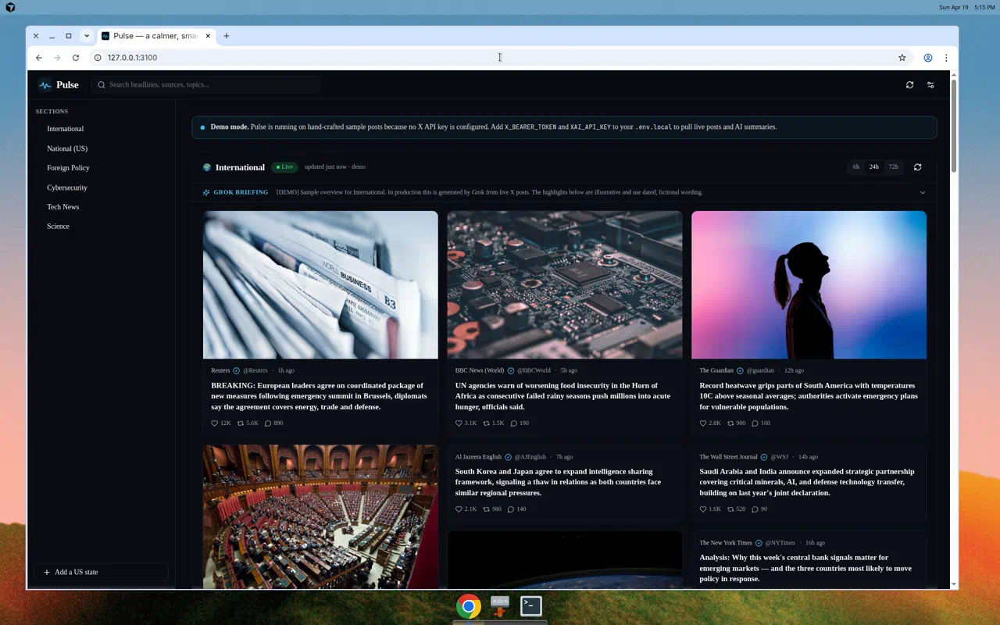

# Pulse

**A calmer, smarter news reader powered by X and Grok.**

Pulse is a premium dark-mode news dashboard that turns verified X posts into a clean, scannable daily briefing. It feels like a proper news product: pods open into rich in-app modals with full content, inline media, and AI-generated key takeaways. "Open on X" is always one click away, but you never _have_ to leave Pulse to consume the news.


<!-- Add your own screenshots under docs/screenshots/. Placeholders below. -->

## Highlights

- **Beautiful dark-first reading experience.** Masonry grids, carefully tuned typography, and live-pulse indicators that feel alive without being noisy.
- **Always-on core sections** — International, National (US), Foreign Policy, Cybersecurity, Tech News, Science.
- **50 US state sections**, lazy-added from a searchable modal. Every state has a hand-tuned X query blending local outlets and place names.
- **Rich pod modal.** Full post text, all attached media, per-post Grok key takeaways, and a section-wide editorial brief. Primary CTA is "Read full article"; "Open on X" is secondary.
- **Grok summaries** using `grok-4-1-fast-reasoning`. Summaries regenerate only when the underlying tweet set changes (content-hash cache).
- **Durable caching** via Supabase (or in-memory fallback), tunable TTL, and graceful error handling.
- **Timeframe switcher** per section: 6h / 24h / 72h (default 24h).
- **Drag-and-drop sidebar reordering**, with everything persisted to `localStorage` — no account required.
- **Fully responsive**, mobile-first, with skeleton loading and subtle animations.
- **Demo mode** out of the box: run with zero credentials and Pulse still looks and feels real, using deterministic sample posts.

## Tech stack

- [Next.js 15](https://nextjs.org/) (App Router) + TypeScript
- [Tailwind CSS](https://tailwindcss.com/) + [shadcn/ui](https://ui.shadcn.com/)-style components + [lucide-react](https://lucide.dev/)
- [Supabase](https://supabase.com/) (Postgres) for durable caching
- [X API v2](https://developer.x.com/en/docs/x-api) (Bearer Token, read-only)
- [xAI Grok API](https://docs.x.ai/) for summaries and takeaways
- Vitest + Testing Library, Playwright for E2E

## Quick start

```bash
# 1. Install
npm install

# 2. Copy env template and fill in whatever you have
cp .env.example .env.local

# 3. Run (works with ZERO credentials — demo data loads automatically)
npm run dev
```

Open [http://localhost:3000](http://localhost:3000). If you haven't configured `X_BEARER_TOKEN`, Pulse shows a subtle banner and runs on curated sample posts.

### Configuring live data

Add the following to `.env.local`:

```dotenv
X_BEARER_TOKEN=...            # required for live posts
XAI_API_KEY=...               # required for Grok summaries
XAI_MODEL=grok-4-1-fast-reasoning

# Optional — enables durable cross-deploy caching
SUPABASE_URL=...
SUPABASE_SERVICE_ROLE_KEY=...
CACHE_TTL_MINUTES=20
```

The X token is only ever used server-side. All secrets are read from `src/lib/env.ts`; no key ever reaches the browser.

### Supabase schema

If you're using Supabase, apply the schema once:

```bash
psql "$SUPABASE_DB_URL" < supabase/schema.sql
# or paste supabase/schema.sql into the Supabase SQL editor
```

Two tables are created:

| Table        | Purpose                                                  |
| ------------ | -------------------------------------------------------- |
| `posts`      | Cached X results per `(section_id, timeframe)`           |
| `summaries`  | Grok-generated overview + themes + per-post takeaways    |

Row-level security is enabled by default; both tables are read/written only by the server using the service-role key.

## Project structure

```
src/
  app/
    api/feed/route.ts        # GET /api/feed?section=…&timeframe=…
    layout.tsx
    page.tsx                 # Preloads first two core sections
    globals.css
  components/
    pulse/                   # All Pulse-specific UI
      app.tsx                # Client-side orchestrator (state, persistence)
      header.tsx
      sidebar.tsx            # Draggable, "Add State" modal
      section-block.tsx      # Section header, Grok briefing, masonry pods
      news-pod.tsx           # Individual card
      post-modal.tsx         # Rich in-app reader
      settings-dialog.tsx
    ui/                      # shadcn-style primitives (button, dialog, …)
  lib/
    env.ts                   # Typed environment access + demo-mode helpers
    sections.ts              # Core + 50 states with optimized queries
    x-api.ts                 # X API v2 recent search + normalization
    grok.ts                  # xAI chat completions + hashing
    feed-service.ts          # Cache-aware fetch + summary orchestration
    supabase.ts              # Service-role client
    demo-data.ts             # Deterministic demo feeds for zero-config runs
    storage.ts               # localStorage helpers
    types.ts
    utils.ts
supabase/
  schema.sql
tests/
  unit/                      # Vitest
  e2e/                       # Playwright
```

## Adding a new section

### A core section

1. Open `src/lib/sections.ts`.
2. Add a new entry to `CORE_SECTIONS` with a stable `id`, a display `name`, and a tuned X search `query`. Queries are automatically wrapped with shared modifiers (`-is:retweet -is:reply -is:nullcast lang:en ...`).
3. That's it — the UI, API, cache, and Grok layer all key off the id. No DB migration required.

```ts
{
  id: "markets",
  name: "Markets",
  tagline: "Equities, bonds, macro",
  group: "core",
  glyph: "📈",
  query: buildQuery(
    `(${fromList(["WSJmarkets", "business", "FT", "Reuters"])}) OR ("market" OR "S&P 500" OR yields)`,
  ),
}
```

### A new state

States are defined in the same file via `STATE_DEFS`. If one is missing, add `{ slug, name, abbr, outlets, extra }` and the rest is auto-generated.

## Testing

```bash
# Unit tests (utilities + configs + demo data)
npm test

# Full E2E (headless Chromium, desktop + mobile)
npm run test:e2e
```

The E2E suite covers:

- Loading core sections and rendering news pods
- Expanding the Grok briefing
- Opening the rich pod modal, checking that "Read full article" and "Open on X" are present
- Opening on X (link / target validation)
- Adding a new US state section
- Timeframe switching widens the post count (24h → 72h)
- Mobile rendering + modal interaction

Playwright runs with `FORCE_DEMO=1` so tests are deterministic — they never make real API calls.

## Security & privacy

- **No user accounts.** Pulse stores preferences (visible sections, order, collapsed summaries, timeframe, theme, last-visit) in `localStorage` only.
- **All external APIs are called server-side.** `X_BEARER_TOKEN` and `XAI_API_KEY` never leave the Node runtime.
- **No tracking.** Pulse does not include analytics, cookies, or beacons. Open the Network tab and verify.
- **Supabase RLS is enabled by default.** The two cache tables are only reachable by the service role.
- **Responsible sourcing.** Queries prefer verified accounts and original (non-reply, non-retweet) posts, but you should still apply your own editorial judgment to anything surfaced by social signals.

## Legal / attribution

Pulse is an **open-source, personal news reader**. All original content belongs to its creators. Pulse:

- aggregates **publicly available** X posts via the official API,
- generates short AI summaries for convenience,
- links back to X for every post, and
- does **not** claim ownership of any post, image, or video.

Pulse is not affiliated with, endorsed by, or sponsored by X Corp. or xAI. Trademarks belong to their respective owners. Use responsibly and review X's Developer Agreement + Policy before deploying publicly.

## Deployment

Pulse deploys cleanly to [Vercel](https://vercel.com/):

1. Import the repo.
2. Add `X_BEARER_TOKEN`, `XAI_API_KEY`, and (optionally) Supabase env vars in Project → Settings → Environment Variables.
3. Deploy — `/api/feed` runs on the Node runtime, `/` is dynamically rendered.

### Environment variables (full list)

| Variable | Required | Purpose |
| --- | --- | --- |
| `X_BEARER_TOKEN` | for live data | X API v2 Bearer token (read-only) |
| `XAI_API_KEY` | for summaries | xAI Grok API key |
| `XAI_MODEL` | no (default `grok-4-1-fast-reasoning`) | Grok model slug |
| `SUPABASE_URL` | no | Supabase project URL |
| `SUPABASE_SERVICE_ROLE_KEY` | no | Service-role key (server only) |
| `NEXT_PUBLIC_SUPABASE_URL` | no | Mirror of `SUPABASE_URL`, if reading client-side |
| `NEXT_PUBLIC_SUPABASE_ANON_KEY` | no | Anon key, if you build read-only client features |
| `CACHE_TTL_MINUTES` | no (default 20) | Cache window for feeds |
| `FORCE_DEMO` | no | Set to `1` to force demo data regardless of tokens |

## License

MIT — see [LICENSE](./LICENSE).

---

<sub>Pulse is a personal news reader that aggregates publicly available X posts and generates AI summaries. All original content belongs to its creators. This project links back to X and does not claim ownership of any posts.</sub>
